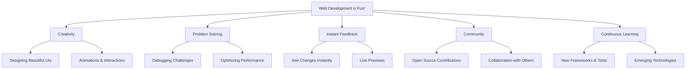

### Hi there 👋
I'm a frontend developer with over 10 years experience.

```mermaid
graph TD
    A[Web Development is Fun!] --> B[Creativity]
    A --> C[Problem Solving]
    A --> D[Instant Feedback]
    A --> E[Community]
    A --> F[Continuous Learning]

    B --> B1[Designing Beautiful UIs]
    B --> B2[Animations & Interactions]
    
    C --> C1[Debugging Challenges]
    C --> C2[Optimizing Performance]
    
    D --> D1[See Changes Instantly]
    D --> D2[Live Previews]
    
    E --> E1[Open Source Contributions]
    E --> E2[Collaboration with Others]
    
    F --> F1[New Frameworks & Tools]
    F --> F2[Emerging Technologies]
```
